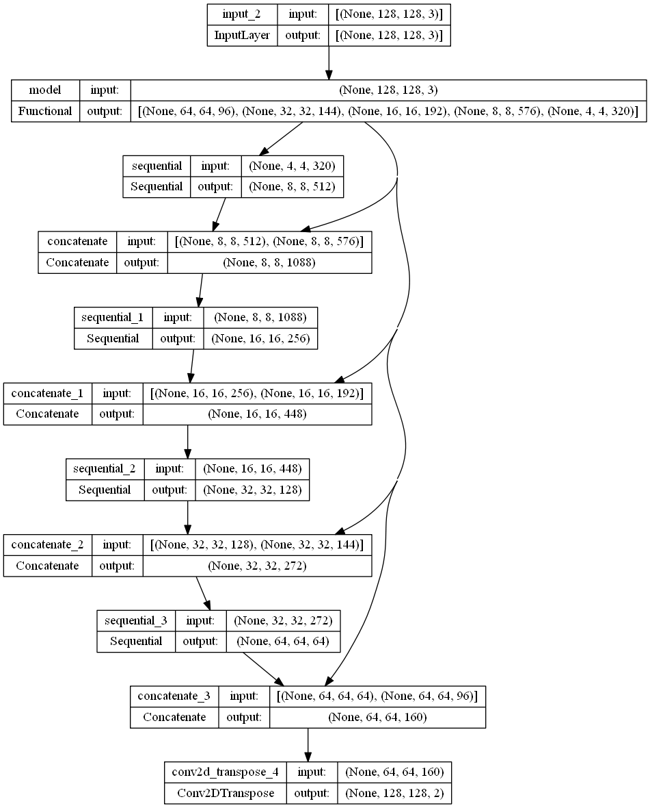

# Cell Nuclei Detection Using Semantic Segmentation

This project aims to develop an automated AI model for identifying nuclei in biomedical images. The identification of cell nuclei is a crucial first step in many research studies because it enables researchers to analyze the DNA contained within the nucleus, which holds the genetic information that determines the function of each cell. By identifying the nuclei of cells, researchers can examine how cells respond to different treatments and gain insights into the underlying biological processes at play.

In this project, we will develop a semantic segmentation model using deep learning techniques that can automatically detect nuclei in biomedical images. The model will be trained on a large dataset of biomedical images and evaluated based on its accuracy and efficiency in detecting nuclei.

# Acknowledgements

We would like to express our gratitude to Kaggle and the Data Science Bowl community for providing the dataset used in this project. The dataset can be found at https://www.kaggle.com/competitions/data-science-bowl-2018/data.

# Build With

  
  
  
  
  
  
  
  

# Project Structure

The code is divided into several sections for data loading, preprocessing, and model training. Here is a detailed explanation of each section:

## 1. Load the Data

The first section of the code loads the data from the file system using OpenCV. The images and masks are loaded separately and stored in two lists. The images are resized to 128 x 128 and converted to RGB format. The mask images are resized to 128 x 128 and converted to grayscale. The images and masks are then converted into NumPy arrays and printed as a sample using Matplotlib.

  
   
  <em>Sample Images vs Masks From Train Dataset</em>

## 2. Data Preprocessing

In this section the mask images are expanded to include an extra dimension of size 1, and then converted into binary class labels. The input images are normalized to a range between 0 and 1. The dataset is split into training and test sets using Scikit-learn's train_test_split() function. The numpy arrays are converted into TensorFlow datasets, which are then combined using the zip() method to create tuples of images and their corresponding masks.

## 3. Visualizing Some Examples

In this section, the display function is defined, which takes a list of three images: the input image, the true mask, and the predicted mask. It displays these images side by side using plt.subplots.

Then, the train_batches dataset is looped through twice using a for loop. For each iteration, it gets the first image and mask from the batch and displays them using the display function defined earlier. This allows us to visualize some examples of the images and masks in the training set.

## 4. Create image segmentation model

The U-Net model has 6.5 million parameters and takes an input tensor of shape [128, 128, 3]. It uses MobileNetV2 layers for feature extraction and a series of convolutional layers for upsampling, with skip connections between them. The final layer is a Conv2DTranspose that produces an output tensor of the same size as the input, with output_channels classes. The model has a sequential structure and intermediate layers are named by their functionality. The summary shows the output shape and number of parameters for each layer.

  
   
  <em>U-Net model Architecture</em>

  
   
  <em>U-Net model Summary</em>

## 5. Predictions

In this section, we define two functions for visualizing the predicted segmentation masks generated by our U-Net model. The create_mask function converts the output of our model into a mask tensor, while the show_predictions function displays the input image, true mask, and predicted mask for a given dataset or a single example. These functions help us evaluate the performance of our model on a given dataset.

  
   
  <em>Predicted Mask Before Training</em>

  
   
  <em>Predicted Mask After 10 Epochs</em>

## 6. Callbacks and Model Training

In this section, we define a DisplayCallback class that is used to display the model predictions during training. The on_epoch_end method of this class is called at the end of each epoch to display the predictions on a sample input image and its corresponding mask.

We also define a TensorBoard callback to log the model training metrics for visualization in TensorBoard.

Finally, we fit the model to the training data using the fit method. The training is performed for a specified number of epochs and the validation data is evaluated after each epoch. The display_callback and tensorboard_callback are used as callbacks during training.

The training history is stored in the history object, which can be used to plot the training and validation metrics.

  
   
  <em>Training vs Validation Accuracy</em>

  
   
  <em>Training vs Validation Loss</em>

## 7. Testing the U-Net Model with Test Data

The code in this section loads test images and masks using OpenCV and resizes them to 128x128 pixels. It then converts them to NumPy arrays, normalizes the pixel values of the test images, and uses the show_predictions function to visualize the predicted masks for the test images. The show_predictions function displays the input image, true mask, and predicted mask for a specified number of examples.

  
   
  <em>Output 1</em>

  
   
  <em>Output 2</em>

  
   
  <em>Output 3</em>

  
   
  <em>Output 4</em>

  
   
  <em>Output 5</em>

  
   
  <em>Output 6</em>

  
   
  <em>Output 7</em>

  
   
  <em>Output 8</em>

  
   
  <em>Output 9</em>

  
   
  <em>Output 10</em>

## Conclusion

In this code, we have implemented an image segmentation task using the U-Net model architecture in TensorFlow. We have shown how to load the data, preprocess it, define the model architecture, and train the model. With this code as a starting point, you can experiment with different datasets, model architectures, and hyperparameters to improve the accuracy of the model.
